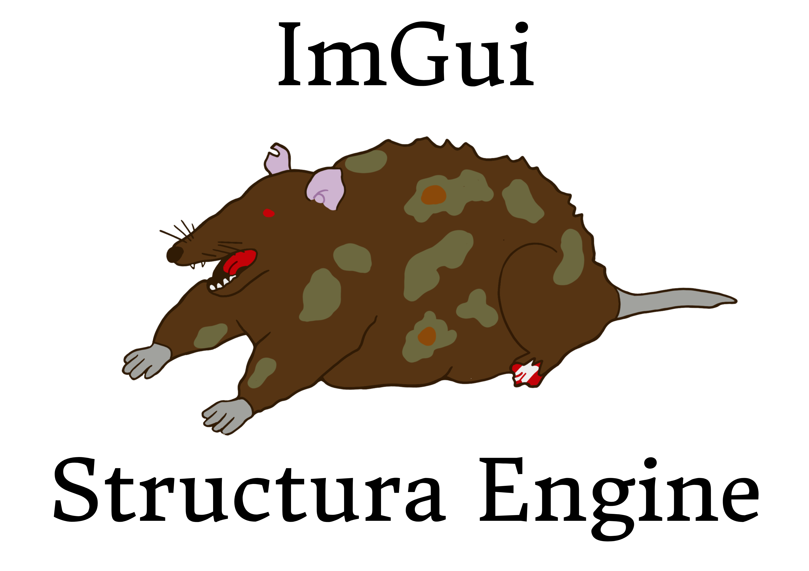

# ImGui library for Structura engine

I'm not sure if it works for all platforms yet. I'm using NixOS and I needed to compile ImGui myself because version from nix packages doesn't include needed backends to work with SDL3.
